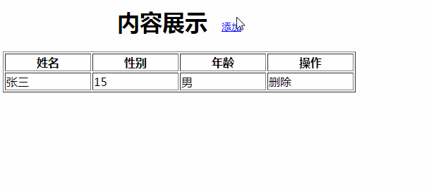
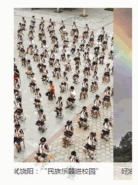

# 二阶段机试考题

## 第一题

| 效果示意图             |
| ---------------------- |
|  |

得分说明：

1. 表单和表格不同时显示，表格有默认值（张三的数据）（5分）
2. 点击添加按钮将表单中输入的数据添加到表格中（5分）
3. 表单各项内容不允许为空（4分）
4. 年龄必须为数字（5分）
5. 能实现表格的删除效果（5分）

## 第二题

| 效果示意图           |
| -------------------- |
|  |

得分说明：

1. 能实现排序（使用冒泡或者选择排序）（10分）
2. 能将排序后的数据展示在页面中（使用遍历）（10分）

## 第三题

| 效果示意图           |
| -------------------- |
|  |

得分说明：

1. 实现基本布局（5分）
2. 所有轮播（左右键点击，小方点点击，自动轮播）都是滑动轮播（4分）
3. 可以实现循环播放，向右轮播 - 当轮播完最后一张图后可以继续播放第一张图；向左轮播 - 当轮播完第一张图后，可以继续播放最后一张图（2）
4. 左右箭头和小方点，点击太快的时候不允许出现混乱（4分）
5. 播放当前图片，下面的小方点和图片相对应，当前小方点为橙色背景，其他小方点为浅灰色背景（4分）
6. 文字跟随图片轮播，且背景有透明度（4分）

## 第四题

| 效果示意图           |
| -------------------- |
|  |

得分说明：

1. 开始计时，毫秒数开始切换（5分）
2. 开始按钮点击后，按钮文字换成重置（5分）
3. 点击重置按钮，定时器清除，所有数字都还原成最初的0（5分）
4. 点击暂停计时，可以将定时器清除，上面的数字保持现状（5分）
5. 点击暂停按钮后，按钮上的文字换成继续（5分）
6. 点击继续按钮，定时器可以根据上面的数字继续（5分）
7. 使用面向对象的方式实现（3分）

提示：因为1秒等于1000毫秒要等待的时间太长，所以在题目中，将1秒当做250毫秒来做，数字递增1变成递增4